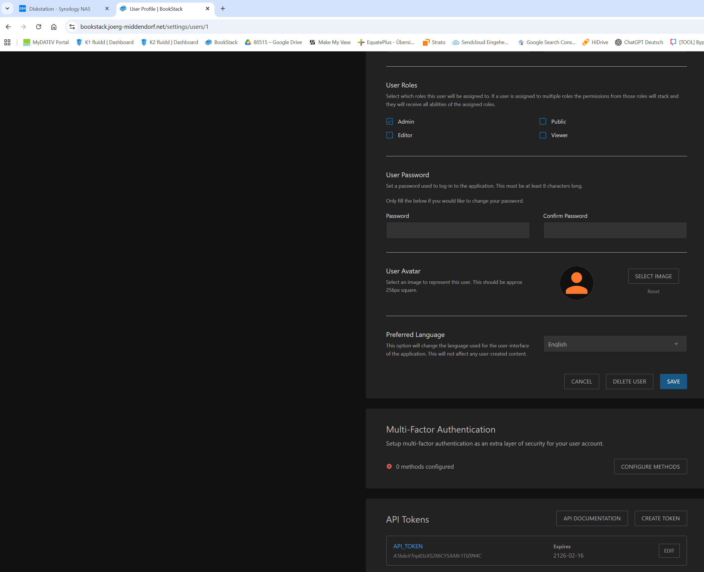

# Confluence -> BookStack Migration (inkl. Bilder)

Die URL `https://joergmiddendorf.atlassian.net/wiki/home` ist nicht öffentlich. Es ist ein Login erforderlich.

## Was das Skript macht

- liest alle Seiten eines Confluence Spaces (Cloud) via REST API
- erstellt **vor jeder Migration** eine Übersicht als Markdown (inkl. Statistik)
- erwartet danach eine Benutzer-Bestätigung (außer mit `--yes`)
- erstellt in BookStack ein Buch pro Confluence Space
- überträgt Seiteninhalt als HTML
- lädt Bilder aus Confluence herunter und in BookStack hoch (Image Gallery)
- ersetzt Bild-URLs im Seiteninhalt durch BookStack-URLs

## Voraussetzungen

- Python 3.10+
- Python-Paket: `requests`
- Confluence Cloud API Token
- BookStack API Token mit Berechtigung für API-Zugriff und Inhalts-Erstellung

## API-Token in der UI erzeugen

### Confluence / Atlassian API-Token (für `CONFLUENCE_API_TOKEN`)

Der Confluence API-Token wird über die Atlassian-Account-Oberfläche erstellt:

1. In Confluence oben rechts auf dein Profil gehen.
2. **Profile** / **Manage account** öffnen.
3. Zum Reiter **Sicherheit** wechseln.
4. Die Seite `https://id.atlassian.com/manage-profile/security/api-tokens` öffnen.
5. Auf **API-Token erstellen** klicken.
6. Einen Namen vergeben (z. B. `ConfluenceToBookStack`) und Token erzeugen.
7. Token sofort kopieren und in `.env` bei `CONFLUENCE_API_TOKEN` eintragen.

Beispielbild (Atlassian API-Token UI):


### BookStack API-Token (für `BOOKSTACK_TOKEN_ID` / `BOOKSTACK_TOKEN_SECRET`)

Der BookStack API-Token kann in der BookStack-UI unter deinem Benutzerprofil erstellt werden:

1. In BookStack als Benutzer mit API-Berechtigung anmelden.
2. Benutzerprofil öffnen (Edit Profile / Benutzer bearbeiten).
3. Zum Bereich **API Tokens** scrollen.
4. **Create Token** klicken.
5. Token-ID und Secret in `.env` als `BOOKSTACK_TOKEN_ID` und `BOOKSTACK_TOKEN_SECRET` eintragen.

Beispielbild (BookStack Benutzerprofil mit API-Token-Bereich):



## Einrichtung

1. Beispiel-Datei kopieren und ausfüllen:

   - `.env.confluence_bookstack.example` -> `.env`
  - `BOOKSTACK_BASE_URL` ist bei dir: `https://bookstack.joerg-middendorf.net`

2. Benötigtes Paket installieren:

   ```powershell
   pip install requests
   ```

3. Umgebungsvariablen aus `.env` in die aktuelle Shell laden (PowerShell):

  1. In den Projektordner wechseln, in dem die Datei `.env` liegt:

    ```powershell
    Set-Location "\\192.168.4.20\Diskstation\Dokumente\Computer Netzwerk\ConfluenceToBookstack"
    ```

  2. Variablen in die aktuelle PowerShell-Session laden:

    ```powershell
    Get-Content .env | ForEach-Object {
      if ($_ -match '^(?!#)([^=]+)=(.*)$') {
       [Environment]::SetEnvironmentVariable($matches[1], $matches[2], 'Process')
      }
    }
    ```

  3. Kurz prüfen, ob die wichtigsten Werte geladen sind:

    ```powershell
    $env:CONFLUENCE_BASE_URL
    $env:CONFLUENCE_SPACE_KEY
    $env:BOOKSTACK_BASE_URL
    ```

  4. Optional: Alle relevanten Variablen auf einen Blick prüfen:

    ```powershell
    Get-ChildItem Env: | Where-Object Name -match 'CONFLUENCE|BOOKSTACK' | Sort-Object Name
    ```

  Hinweise:
  - Das Laden gilt nur für die aktuelle Terminal-Session. Bei einem neuen Terminal Schritt 3 erneut ausführen.
  - Achte darauf, dass in `.env` keine Platzhalter mehr stehen (z. B. `DEIN_SPACE_KEY`).
  - Wenn Sonderzeichen in Tokens enthalten sind, Werte in `.env` in Anführungszeichen setzen.

## Ausführung

- Nur Zugangsdaten prüfen (ohne Migration):

  ```powershell
  python confluence_to_bookstack_migration.py --check-credentials
  ```

- Zugangsdaten prüfen mit erweiterten Ursachen-Hinweisen:

  ```powershell
  python confluence_to_bookstack_migration.py --check-credentials --debug-auth
  ```

- Testlauf (ohne Schreibzugriffe in BookStack):

  ```powershell
  python confluence_to_bookstack_migration.py --dry-run
  ```

- Nur Übersicht + Statistik erstellen (empfohlen vor echtem Lauf):

  ```powershell
  python confluence_to_bookstack_migration.py --overview-only
  ```

- Übersicht in benannte Datei schreiben:

  ```powershell
  python confluence_to_bookstack_migration.py --overview-only --overview-file migration_overview_CN.md
  ```

- Echter Lauf:

  ```powershell
  python confluence_to_bookstack_migration.py
  ```

- Echter Lauf ohne interaktive Rückfrage nach der Übersicht (z. B. für Automatisierung):

  ```powershell
  python confluence_to_bookstack_migration.py --yes
  ```

## Hinweise

- BookStack unterstützt maximal `Buch -> Kapitel -> Seite`.
  Tiefer verschachtelte Confluence-Seiten werden im Seitentitel über einen Pfad abgebildet.
- Die Confluence-Abfrage verwendet Cursor-Pagination und berücksichtigt damit mehr als 50 Einträge pro Space.
- Komplexe Confluence-Makros können in BookStack nicht 1:1 übernommen werden.
- Interne Link-Umschreibung ist als Basis implementiert und kann je nach Linkformat erweitert werden.
- Das Skript prüft Platzhalterwerte in `.env` (z. B. `DEIN_SPACE_KEY`, `bookstack_token_id`) und bricht mit klarer Meldung ab, falls diese nicht ersetzt wurden.
- Standard-Dateiname für die Übersicht ist `migration_overview_<space>.md` (z. B. `migration_overview_cn.md`).
